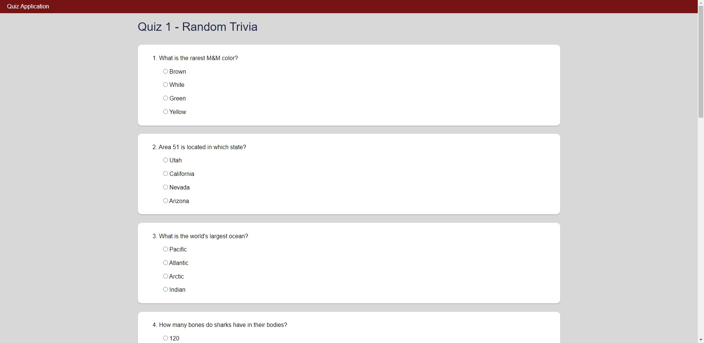
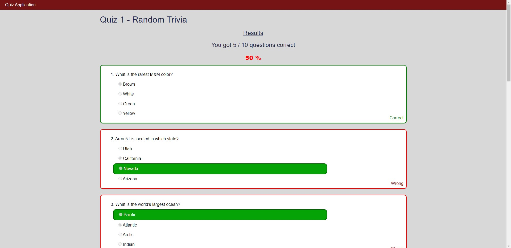

# Quiz App

Using Vite and Vue.js v3, I've created a quiz web app from a mockup. The purpose of this application is to provide multiple choice questions to the user, and automatically grade and give feedback to them after it is submitted.

I've used some random trivia questions that I've found online and can be seen inside of my `questions.json` file for my example.

## Snapshots

| Main Quiz |
|-----------|
| |

| Unanswered Questions | Submitted Quiz |
|----------------------|----------------|
|| |

| Mobile View | Tablet View |
|-------------|-------------|
|||

## Key Notes

This is my first Vue project and so there may be areas where I've leaned a bit more on vanilla javascript whereas any future projects that I may do that include Vue will most likely include more efficient Vue tactics tailored towards efficiency and optimization.

## Run Locally

Clone the project

```bash
  git clone https://github.com/Chudii/quiz-app-vue.git
```

Go to the project directory

```bash
  cd quiz-app-vue
```

Install dependencies

```bash
  npm install
```

Start the server

```bash
  npm run dev
```

## Acknowledgements

* Snow Joe (inspired app)

## Contact

[](https://www.linkedin.com/in/chudi-ibida/)

[](https://github.com/Chudii)
